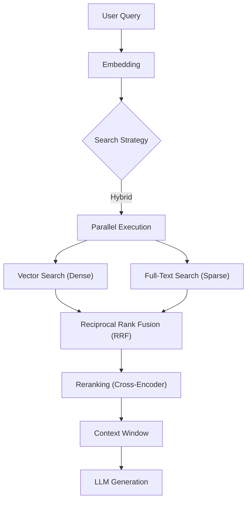

# Enterprise RAG Platform

Multi-tenant Retrieval-Augmented Generation with FastAPI, PostgreSQL + PGVector, configurable LLM providers, and a production-style architecture you can run locally or ship to the cloud.

## What you get
- Tenant-aware knowledge bases with CRUD APIs.
- Document ingestion from files or URLs → extraction → chunking → embeddings → PGVector.
- Search modes: vector, full_text, or hybrid (RRF) with optional reranking.
- RAG query endpoint that returns answers plus cited sources.
- JWT auth, request logging, latency headers, Prometheus metrics.
- Docker Compose for Postgres + API; works on Render/Fly or plain VMs.

Recent highlights:
- Hybrid search selectable per request (`vector`, `full_text`, `hybrid`).
- Dynaconf settings (`settings.toml`, `.secrets.toml`, `RAG_*` env overrides).
- Consistent error handling via custom exceptions.

## Quick start
Pick one of the two ways to run it.

**Docker (recommended)**
```bash
docker-compose up --build
```
- Starts Postgres with PGVector and the API on `http://localhost:8000`.
- Extension auto-enabled by `db/init/01-enable-vector.sql`.
- Admin console served at `http://localhost:8080` (via nginx) or `http://localhost:8000/ui` (directly from the API).

**Local Python**
```bash
python -m venv .venv && source .venv/bin/activate
pip install -r requirements.txt
PYTHONPATH=backend uvicorn app.main:app --app-dir backend --reload
```
- Requires Python 3.11+ and a running Postgres that matches `database_url` in `settings.toml` (or override via env).
- Admin console served from `http://localhost:8000/ui` when the server is running.

**Frontend (React)**
- Requires Node 18+.
- Install deps: `cd frontend && npm install`
- Dev server: `npm run dev` (defaults to `http://localhost:5173`, calls API on `http://localhost:8000`)
- Build static assets into the API: `npm run build` (outputs to `backend/app/static`)

## Configuration
- Defaults: `settings.toml`
- Secrets: `.secrets.toml` (not in git)
- Env overrides: prefix with `RAG_` (e.g., `RAG_LLM_PROVIDER=openai`, `RAG_JWT_SECRET=...`)
- Key knobs: `database_url`, `jwt_secret`, `embedding_model_name`, `llm_provider`/`llm_model`, `reranker_model_name`, `vector_dimension`, `normalize_embeddings`.

## API cheat sheet
- `POST /kb` — create KB.
- `GET /kb` — list KBs.
- `DELETE /kb/{kb_id}` — delete KB (cascades docs/chunks).
- `POST /ingest` — multipart upload: `file`, `kb_id`, optional `metadata` JSON, optional `idempotency_key`.
- `POST /ingest_url` — body: `{ "kb_id": "...", "url": "...", "metadata": {} }`.
- `GET /documents` — list docs (optional `kb_id`).
- `GET /documents/{document_id}` — doc status + metadata.
- `GET /documents/{document_id}/chunks` — raw chunks for a doc.
- `POST /rag/query` — body: `{ "kb_id": "...", "query": "...", "top_k": 5, "max_tokens": 128, "use_rerank": true, "search_type": "hybrid" }`.
  - `search_type`: `vector` | `full_text` | `hybrid` (default).
  - `use_rerank`: true by default.
- `POST /auth/token` — body: `{ "tenant_name": "acme-inc" }` → returns `{ token, tenant_id, tenant_name, expires_at }`.
- Auth: `Authorization: Bearer <jwt-with-tenant_id>`.
- Settings peek: `GET /settings`.

Generate a tenant-scoped token:
```bash
python backend/scripts/generate_jwt.py --secret <JWT_SECRET>
```

## Data flow


## Project layout
- `backend/app` — FastAPI app, routers, services (ingestion, embeddings, rerank, RAG), auth deps, observability, config.
- `backend/alembic` — migrations.
- `backend/scripts` — utilities (e.g., JWT generator).
- `backend/app/static` — zero-build admin console served at `/ui`.
- `db/init` — PGVector init SQL.
- `docs` — architecture notes/diagram.
- `docker-compose.yml` — API + Postgres stack.

## Testing
```bash
PYTHONPATH=backend pytest
```
- Uses SQLite for tests; production uses Postgres + PGVector.

## Deployment notes
- Rebuild containers after changing models/deps: `docker-compose up --build --force-recreate`.
- For real LLMs set `RAG_LLM_PROVIDER` + `RAG_LLM_MODEL` + `RAG_LLM_API_KEY`.
- Skip auto table creation in production with `SKIP_DB_INIT=1`; apply migrations instead.

## References
- Architecture: `docs/Architecture.md`
- CI: `.github/workflows/ci.yml`
